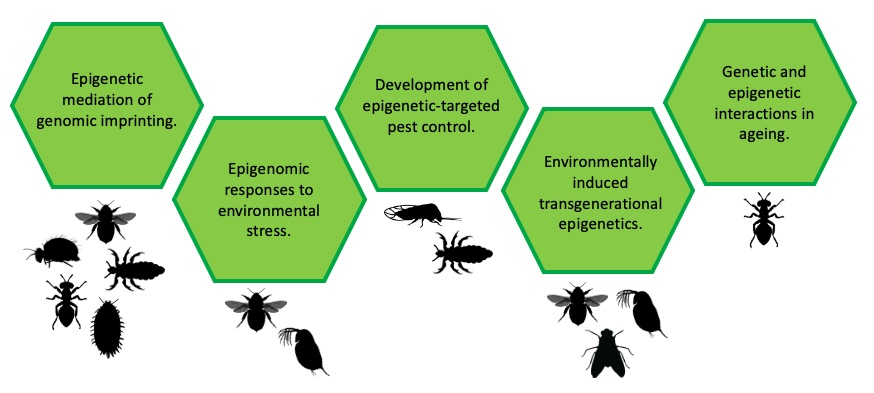

**I am broadly interested in the role of epigenomic mechanisms in evolutionary processes.**

Primarily my research involves experimental evolution and the analysis of sequencing data, with a focus on arthropod species. However, I have plans to engage in some fieldwork studies of natural populations in the near future. Specifically, my focus is on the role of transgenerational epigenomic inheritance in species adaptation.

{:height="75%" width="75%" .center-image} 

<h2>A rough list of some of the things I work on:</h2>

<h3>Genomic Imprinting</h3>

- Gene imprinting in bumblebees, as a test for Haig's kinship theory.
- The role of DNA methylation in paternal genome elimination in mealybugs.
- Parent-of-origin gene expression in head and body lice.

<h3>Adaptive Epigenetics</h3>

- Temporal population epigenetics in a freshwater crustacean.
- Epigenetic responses to pollutant exposure, e.g. pesticides, microplastics.
- The effects of hatchery rearing on UK freshwater coarse fish.
- The relationship between the genome and epigenome: epigenetic mediated mutation.

<h3>Other</h3>

- Sex-specific DNA methylation in an invasive crop pest species.
- The relationship between histone acetylation and DNA methylation in parasitic wasps.

For a summary of this work, see my [Google Scholar page](https://scholar.google.com/citations?user=qptVoSMAAAAJ&hl=en).

