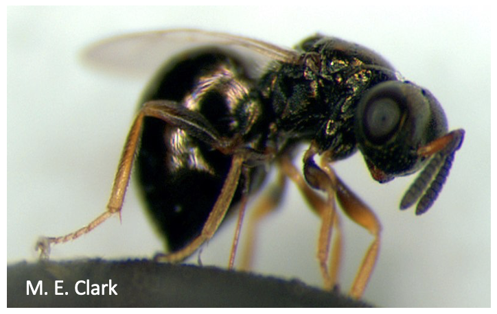
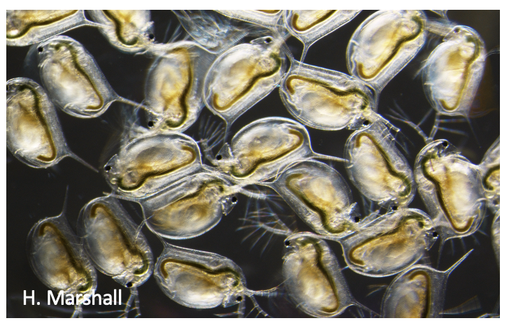
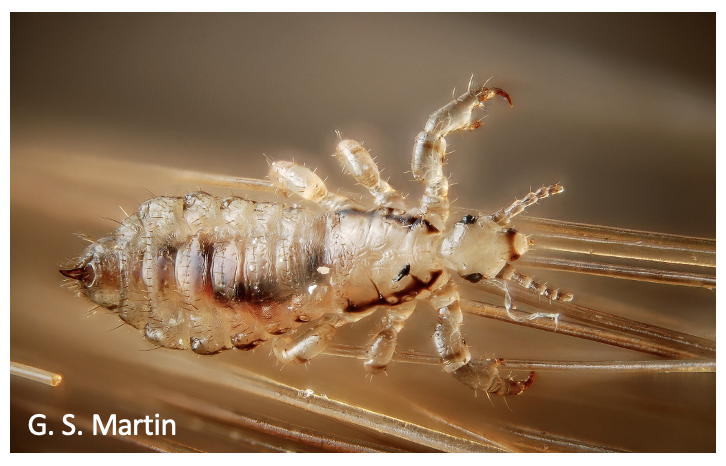

{:width="250px" .align-right} 

<h3>Transgenerational consequences of environmental exposure</h3>
Environmental pollution is a major cause of both human disease and species population declines. In order to identify populations most at risk we need to understand not only the individual consequences of pollution exposure but also the transgenerational consequences. Given the long generation time of humans/mammals and the need for ethical practices, we use model arthropod species to examine the epigenetic changes caused by pollution and to underdstand how these changes are inherited across generations. 

Currently the lab has ongoing projects on pesticides, herbicices, endocrine disruptors and microplastics.

---

<h3>The role of epigenetic mechanisms in species adaptation</h3>
Climate change and human impact are currently the major drivers of species loss. Some models have predicted that we are in the midst of a sixth mass extinction event. We need to understand how species can adapt to rapid environmental change in order to mitigate these losses. Epigenetic mechanisms have been predicted to play a role in rapid species adatation. We use the newly emerging field of population epigenetics to examine the relationship between the genome and epigenome, in the context of species adaptation.

Currently the lab has ongoing projects on temporal population epigenetics in waterfleas and the genome/epigenome interaction in jewel wasps.

---

<h3>Development of novel pest/parasite epigenetic-targeted treatments</h3>
In addition to being a major environmental pollutant, pesticides are losing efficacy as species adapt. There is, therefore, a need for novel species-specific remidies. Head and body lice pose an interesting system, where one ecotype (body lice) transmits disease at a much greater rate compared to the other ecotype (head lice). We're exploring the epigenetic landscape of this system to potentially develop novel pest-control strategies.

---

<h2>Previous Projects:</h2>

- Genomic imprinting in bumblebees, as a test for Haig's kinship theory.
- The role of DNA methylation in paternal genome elimination in mealybugs.
- Characterisation of sex-specific DNA methylation profiles in crop pest species.